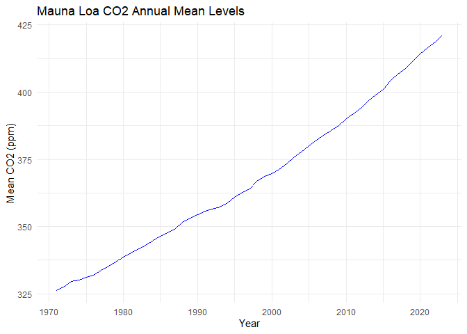
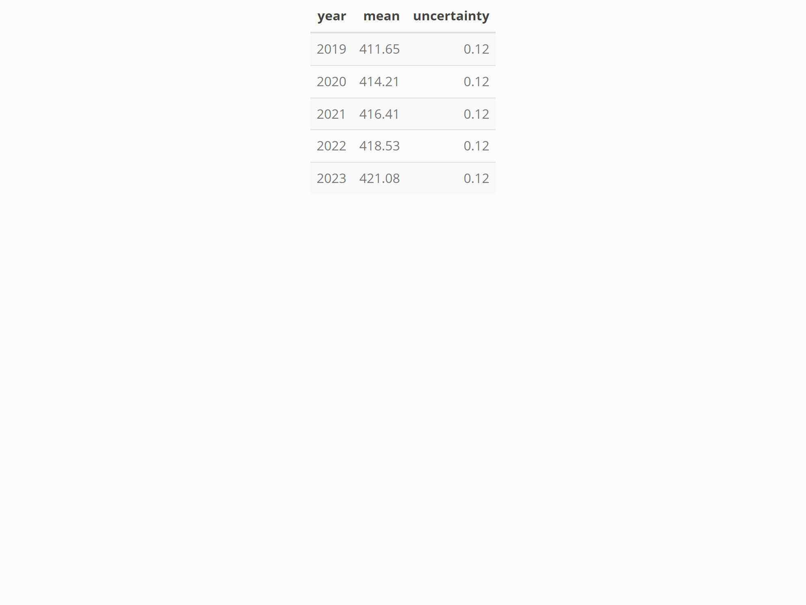

# CS_08


## Data Import and Plotting

``` r
# 加载所需库
library(readr)
library(ggplot2)
library(knitr)
library(kableExtra)

# 下载并读取数据
url <- "ftp://aftp.cmdl.noaa.gov/products/trends/co2/co2_annmean_mlo.txt"
data <- read_table(url, skip = 57, col_names = c("year", "mean", "uncertainty"))
```


    ── Column specification ────────────────────────────────────────────────────────
    cols(
      year = col_double(),
      mean = col_double(),
      uncertainty = col_double()
    )

``` r
# 绘制 CO2 随时间变化的折线图
plot <- ggplot(data, aes(x = year, y = mean)) +
  geom_line(color = "blue") +
  labs(title = "Mauna Loa CO2 Annual Mean Levels",
       x = "Year",
       y = "Mean CO2 (ppm)") +
  theme_minimal()
print(plot)
```



## Summary Table

``` r
# 生成表格并使用 kableExtra 美化
summary_table <- data %>%
  tail(5) %>%
  kable() %>%
  kable_styling(bootstrap_options = c("striped", "hover"), full_width = F)

# 保存表格为 HTML
save_kable(summary_table, file = "summary_table.html")

# 使用 webshot2 将 HTML 文件保存为 PNG
webshot2::webshot("summary_table.html", file = "table.png", zoom = 2)
```



## Hidden Calculations Example
